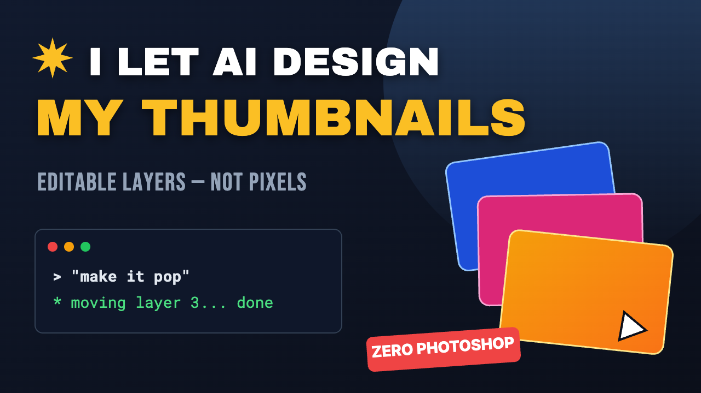
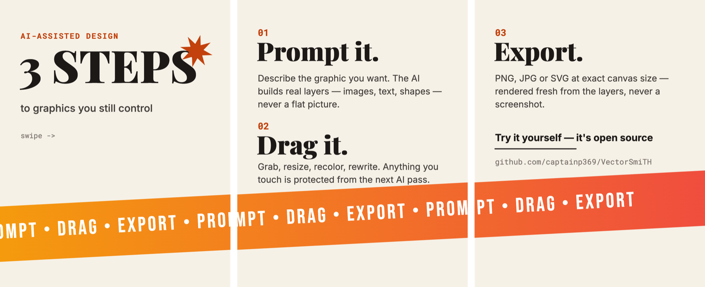

# VectorSmiTH

**AI-assisted graphic & thumbnail editor — "Canva via Claude Code."**

Drop in assets, describe the graphic you want, and the AI generates an
**editable layered scene** — not a flat image. Every layer it creates is
draggable, resizable, rotatable, and reorderable in the same canvas UI you'd
use by hand. Export to PNG/JPG/SVG only when you're happy.

Think *Remotion, but for static graphics*: the AI's output is a structured
scene graph (`scene.json`), the UI renders it live, and a rasterized image is
the last step — never the medium.

<p align="center">
  <br/>
  <sub>Generated from a prompt, then opened in the editor — every card, badge, and line of text above is its own draggable layer.</sub>
</p>

## The workflow (works with a Claude subscription — no API key)

The same loop as editing video with Claude Code + a timeline tool, but for
static graphics:

```
┌─────────────────┐  edits scene.json   ┌──────────────────┐
│   Claude Code    │ ──────────────────▶ │  Browser canvas   │
│  "make a YouTube │                     │  localhost:5173   │
│   thumbnail from │ ◀────────────────── │  drag, resize,    │
│   this photo…"   │  your manual tweaks │  reorder, retype  │
└─────────────────┘  sync back to file  └───────┬──────────┘
        ▲                                        │
        └── re-prompt for the next AI pass       ▼
            (your touched layers are safe)   Export PNG/JPG/SVG
```

1. **Generate with Claude Code.** Run `claude` in this project and describe
   the graphic — *"make a YouTube thumbnail from assets/photo.jpg, bold Thai
   headline top-left, dark gradient behind the text."* Claude Code edits
   `scene.json`; the dev server watches the file and the canvas updates
   **live**. This uses your normal Claude subscription — no API key.
2. **Tweak by hand in the browser.** Drag, resize, rotate, reorder, retype.
   Everything you touch is marked `"touched": true` in the file.
3. **Go back to Claude Code when you need AI again.** *"Make the headline
   bigger", "add a subscribe badge bottom right"* — it edits the scene in
   place and preserves the layers you adjusted by hand.
4. **Export** from the toolbar at exact canvas dimensions.

The prompt box at the bottom of the UI is an **optional** second path: it
calls the Claude API directly from the browser for people who prefer AI
in-app and have an API key (⚙ settings; the key stays in your browser).
Subscription users can ignore it.

## Quick start

```bash
git clone https://github.com/captainp369/VectorSmiTH.git && cd VectorSmiTH
npm install
npm run dev        # open http://localhost:5173
claude             # in a second terminal — then just ask for a design
```

### Or let your AI set it up

Paste this into Claude Code (or any coding agent) and it will do the rest:

> Set up this project for me: clone `https://github.com/captainp369/VectorSmiTH.git`,
> install dependencies, start the dev server, open http://localhost:5173,
> then ask me what graphic I want to make.

Try it without AI: `cp examples/youtube-thumbnail.json scene.json` and watch
the canvas. More in [examples/](examples/README.md).

## Examples

<table>
<tr><td width="55%">

**A 3-slide carousel where the design flows across pages** — one band, same
layer, shifted a page-width left each slide. `examples/ig-carousel-3-slides.json`

</td><td>

**A minimal editorial post** — starter for social content that isn't a
thumbnail. `examples/ig-post-starter.json`

</td></tr>
<tr><td>

</td><td>

</td></tr>
</table>

## Editor features

- **Canvas presets** — YouTube 1280×720, IG post 1080×1080, IG story
  1080×1920, X post, OG image, or custom W×H; resizing keeps layers
  (optionally scaled to fit).
- **Direct manipulation** — drag, corner/edge resize handles, rotation,
  multi-select (shift-click or rubber-band drag), snap guides against canvas
  edges/centers and other layers, arrow-key nudging.
- **Layers panel** — drag to reorder z-index, show/hide, lock, rename
  (double-click), to-front/back.
- **Text** — double-click on canvas to edit content; font, size, weight,
  color, alignment, line height, letter spacing, and outline/border in the
  inspector. Thai fonts included (Kanit, Noto Sans Thai), plus import your
  own font files (.ttf/.otf/.woff) or type any system font name.
- **Layer types** — image (with interactive crop: drag handles to trim any
  side, drag the photo to slide it inside the frame), text, solid/gradient
  rectangle, circle, regular polygon, star, line.
- **Multi-page projects** — pages bar for carousels and variants: add,
  duplicate, rename, delete pages; "export all pages" numbers the files.
  A continuous IG carousel is one image repeated across pages, shifted one
  page-width left each slide — the AI knows the trick.
- **Inspector** — every numeric field is scrubbable: drag its label
  left/right to dial the value in.
- **Assets** — drag & drop images onto the canvas; files land in `assets/`
  so the AI can reference them by path.
- **Export** — PNG / JPG / SVG at exact canvas dimensions (1×–3×), rendered
  fresh from the scene graph.
- **Persistence** — autosaves to `scene.json` + localStorage; "Save project"
  downloads a portable JSON with images inlined.
- **Undo/redo** — ⌘Z / ⇧⌘Z, ⌘D duplicate, Delete removes.

## The scene graph

`scene.json` is the whole document: canvas size, background, and an ordered
list of layer objects (order = z-index). [CLAUDE.md](CLAUDE.md) documents the
full schema — it doubles as the instruction file that teaches Claude Code how
to design safely (preserve `touched` layers, reference real assets, layout
guidance).

## Contributing

See [CONTRIBUTING.md](CONTRIBUTING.md) — including the 8-step checklist for
adding a new layer type. MIT licensed ([LICENSE](LICENSE)).

## Non-goals (v1)

Real-time collaboration, template marketplaces, photo retouching/masking, and
video/animation are out of scope.
